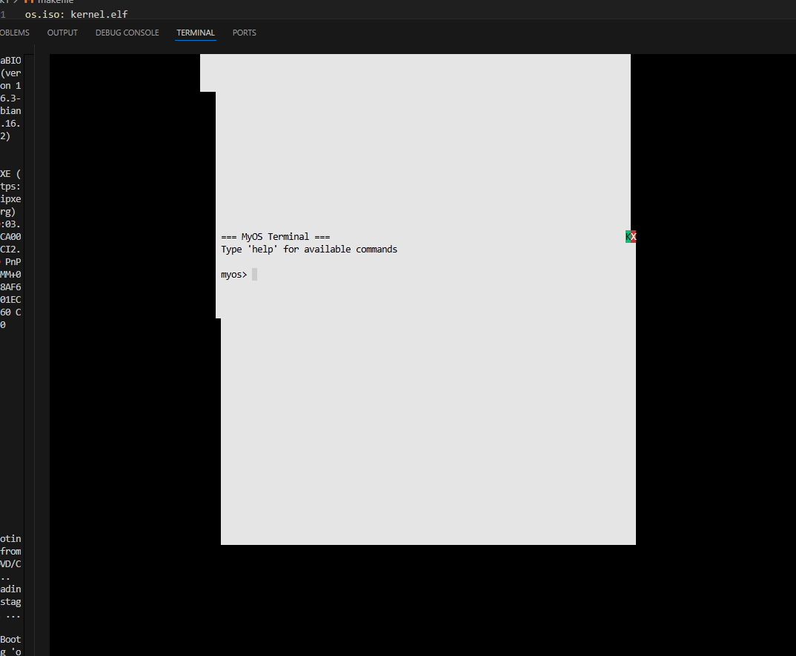

# Worksheet2 Part2 – Mini x86 OS (Keyboard + Interrupts)


This project is a tiny 32-bit x86 OS kernel based on the course book
*“Writing a Simple Operating System from Scratch”*.

The kernel:

- boots via GRUB
- sets up an IDT and remaps the PIC
- enables hardware interrupts
- handles keyboard input
- prints output directly to the VGA text-mode framebuffer

---

## Build & Run

```bash
make        # build kernel + ISO
make run    # run in QEMU
make clean  # clean build files
Main Flow

loader.s
Multiboot entry. Sets up a stack and calls kmain.

kmain.c
Clears the screen, installs the IDT and PIC (interrupts_install_idt),
enables hardware interrupts (enable_hardware_interrupts), then waits in a
loop for interrupts.

Keyboard interrupt

Keyboard raises IRQ1 → mapped to interrupt 33.

CPU jumps to interrupt_handler_33 (in interrupt_asm.s), which calls
interrupt_handler in C.

interrupt_handler reads the scan code from port 0x60, converts it to
ASCII (keyboard_scan_code_to_ascii), prints the character with
fb_write_char, and then acknowledges the PIC.

Important Files

loader.s – Multiboot header and low-level entry; calls kmain.

kmain.c – C entry; sets up interrupts and enables them.

drivers/types.h – Basic integer types (u8int, u16int, …) and colour
constants.

drivers/io.h / io.s – inb / outb functions for port I/O.

drivers/frame_buffer.h / frame_buffer.c
Simple VGA text-mode driver at 0xB8000:

fb_write_char, fb_write_string

fb_newline, fb_backspace, fb_clear

fb_move_cursor

drivers/keyboard.h / keyboard.c
Reads scan codes from port 0x60 and maps them to ASCII characters (letters,
space, Enter, Backspace).

drivers/pic.h / pic.c
Remaps the 8259 PIC and provides pic_acknowledge to send EOI after an
interrupt.

drivers/interrupt_asm.s
Assembly stubs like interrupt_handler_33 that save registers and call the C
interrupt_handler, then return with iret.

drivers/interrupts.h / interrupts.c
Defines the IDT structures, installs the IDT (interrupts_install_idt), and
implements interrupt_handler, which handles the keyboard interrupt.

drivers/hardware_interrupt_enabler.h / .s
Small wrappers for sti / cli:

enable_hardware_interrupts()

disable_hardware_interrupts()

One-Sentence Viva Summary

On boot, GRUB jumps to loader.s, which calls kmain.
kmain installs the IDT, remaps the PIC and enables interrupts.
When I press a key, the keyboard generates IRQ1; this becomes interrupt 33,
goes through my assembly stub to interrupt_handler, which reads the scan
code from port 0x60, converts it to ASCII using the keyboard driver, and
prints the character to the screen using the framebuffer driver.
